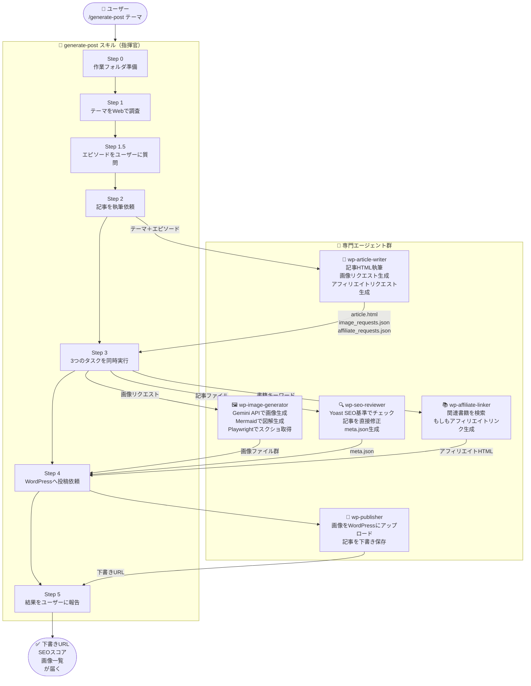
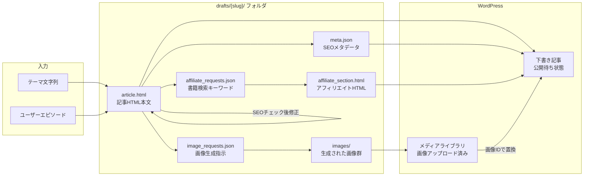
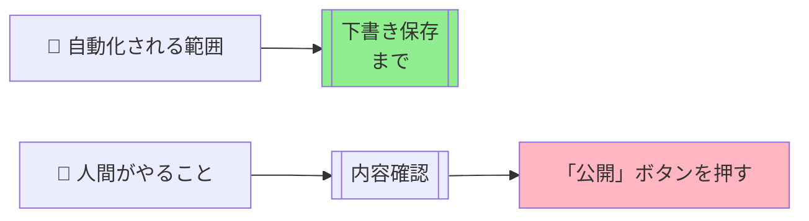

# WordPress自動投稿スキル 初心者向け解説

## これは何？

`/generate-post テーマ名` と入力するだけで、**記事の執筆から画像生成・SEO最適化・WordPress下書き投稿まで**を全自動で実行するスキルです。

人間がやること → **テーマを指定する** と **最後にWordPressで「公開」ボタンを押す** だけ。

---

## 全体の流れ（概要図）



---

## 各エージェントの役割

| エージェント | 役割 | 使うツール |
|---|---|---|
| `generate-post` (スキル本体) | 全体を指揮・段取りする司令塔 | WebSearch, AskUserQuestion, Task |
| `wp-article-writer` | SEO最適化された記事HTMLを書く専門家 | WebSearch, Write |
| `wp-image-generator` | ブログ用画像を3種類の方法で生成 | Gemini API, Mermaid, Playwright |
| `wp-seo-reviewer` | Yoast SEO基準で記事をチェック・修正 | Read, Edit, WebSearch |
| `wp-affiliate-linker` | 記事テーマに合う書籍を探してリンク生成 | WebSearch, WebFetch |
| `wp-publisher` | WordPress REST APIで実際に投稿する | Bash (wp_client.py) |

---

## ファイルの流れ（データの動き）



---

## Step-by-Step 詳細解説

### Step 0: 準備
- 作業フォルダ `drafts/2026-03-04_テーマ名/` を作成
- `images/` サブフォルダも一緒に作成

### Step 1: テーマ調査
- WebSearchで3〜5回検索して最新情報を収集
- 「最近の話題」「よくある悩み」「競合ツール比較」などを把握

### Step 1.5: エピソード収集 ⭐
- 調査結果を踏まえてユーザーに質問
- 「導入のきっかけ」「驚いた体験」「成功体験」などを選んでもらう
- **これにより記事がオリジナリティのある体験談になる**

### Step 2: 記事執筆（wp-article-writer）
- 3,000〜5,000文字のHTML記事を生成
- 出力ファイル:
  - `article.html`: 本文（画像プレースホルダー付き）
  - `image_requests.json`: 何の画像が必要かの指示書
  - `affiliate_requests.json`: 関連書籍の検索キーワード

### Step 3: 3つのタスクを**同時実行**（並列処理）
時間を節約するため、以下を同時スタート:

1. **画像生成**（wp-image-generator）
   - アイキャッチ・挿絵 → Gemini API
   - フローチャート・構成図 → Mermaid CLI
   - 画面キャプチャ → Playwright

2. **SEO最適化**（wp-seo-reviewer）
   - Yoast SEO基準でチェック
   - 記事本文を直接修正（キーフレーズ追加、内部リンク追加など）
   - `meta.json`（タイトル・メタディスクリプション・タグ）を生成

3. **アフィリエイトリンク生成**（wp-affiliate-linker）
   - テーマに合う書籍を検索
   - もしもアフィリエイト「かんたんリンク」HTML を生成

### Step 4: WordPress投稿（wp-publisher）
1. 画像をWordPressメディアライブラリにアップロード
2. 記事HTML内の画像プレースホルダーを実際の`<figure>`タグに置換
3. カテゴリ・タグをWordPressのIDに変換
4. **常に「下書き」として保存**（自動公開はしない）

### Step 5: 結果報告
- 下書き編集URL
- 生成された画像の一覧
- SEOスコア（タイトル文字数、キーワード密度など）
- アフィリエイトリンク情報

---

## 安全設計のポイント



- 公開ステータスは **絶対に `draft`** — コード内でハードコード済み
- 既存記事を上書きしない（常に新規投稿）
- 画像生成失敗でも成功分だけで投稿を続行（部分的な失敗に強い）

---

## 使い方（まとめ）

```
/generate-post Claude Codeの使い方
```

これだけ！あとは：
1. エピソードの質問に答える（1回だけ）
2. 完成の報告を待つ（数分）
3. 届いた下書きURLをクリックして内容確認
4. WordPressで「公開」ボタンを押す
