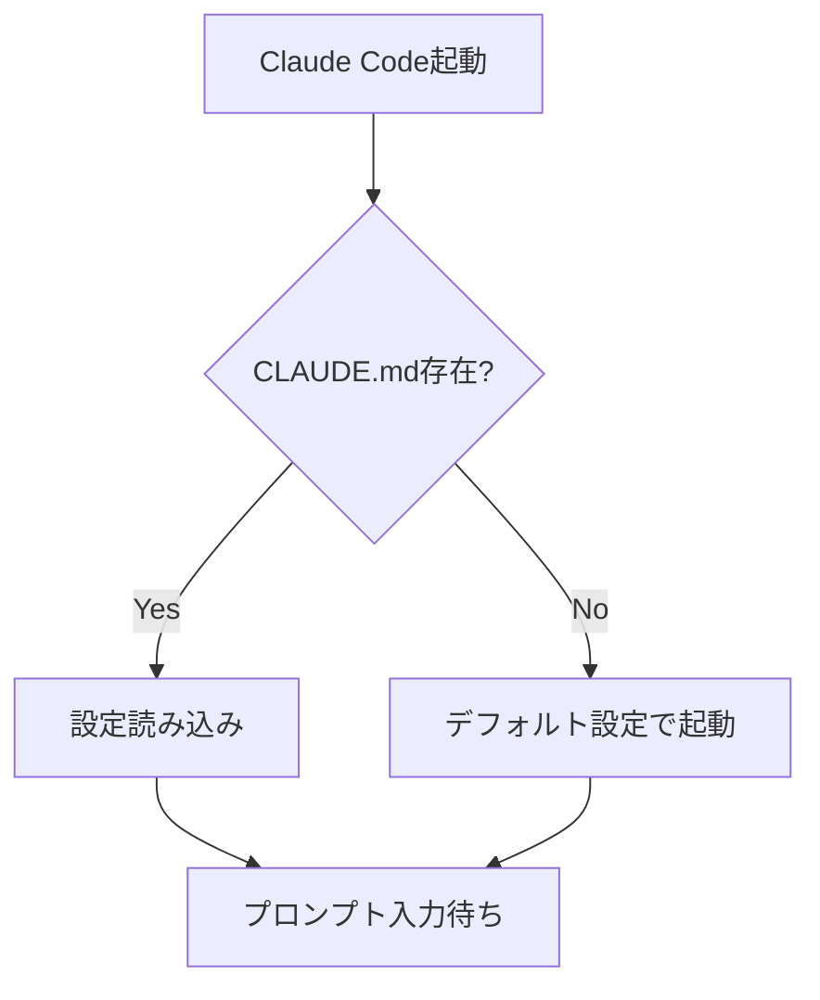
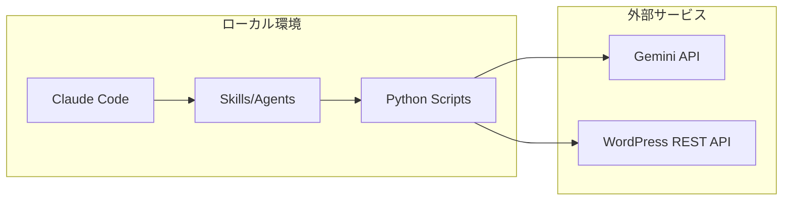
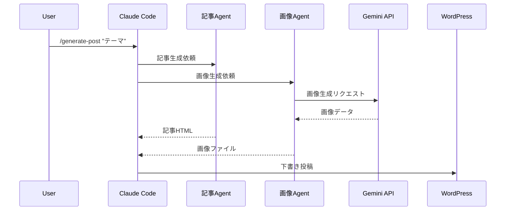

# Mermaid図解生成 調査レポート

## 1. Mermaid CLIツール（mmdc）

### インストール方法

```bash
# グローバルインストール
npm install -g @mermaid-js/mermaid-cli

# npxで都度実行（インストール不要）
npx @mermaid-js/mermaid-cli -i input.mmd -o output.png
```

### Mermaidコード → PNG変換

```bash
# 基本的な変換
mmdc -i diagram.mmd -o diagram.png

# テーマ指定
mmdc -i diagram.mmd -o diagram.png -t dark
# テーマ: default, forest, dark, neutral

# 画像サイズ指定（幅x高さ）
mmdc -i diagram.mmd -o diagram.png -w 1200 -H 800

# 背景色指定
mmdc -i diagram.mmd -o diagram.png -b transparent

# SVG出力
mmdc -i diagram.mmd -o diagram.svg

# PDF出力
mmdc -i diagram.mmd -o diagram.pdf

# 設定ファイル使用
mmdc -i diagram.mmd -o diagram.png -c mermaid-config.json
```

### 設定ファイル例（mermaid-config.json）

```json
{
  "theme": "default",
  "themeVariables": {
    "fontSize": "16px",
    "fontFamily": "'Noto Sans JP', 'Hiragino Sans', sans-serif"
  },
  "flowchart": {
    "htmlLabels": true,
    "curve": "basis"
  }
}
```

### 日本語フォント対応

- mmdcはPuppeteer（ヘッドレスChrome）でレンダリングするため、**システムにインストールされた日本語フォントが利用可能**
- 設定ファイルの`fontFamily`で日本語フォントを指定する
- macOSでは「ヒラギノ角ゴシック」、Linuxでは「Noto Sans JP」が推奨
- `htmlLabels: true` で日本語テキストの折り返しが正常に動作

---

## 2. Mermaid API（mermaid.ink）

### Web APIでの変換

mermaid.ink は無料のレンダリングサービス。MermaidコードをBase64エンコードしてURLに埋め込む。

```
https://mermaid.ink/img/{base64_encoded_mermaid_code}
https://mermaid.ink/svg/{base64_encoded_mermaid_code}
```

### Pythonからの呼び出し

```python
import base64
import requests
import json

def mermaid_to_png(mermaid_code: str, output_path: str) -> str:
    """Mermaidコードをmermaid.ink APIでPNG画像に変換"""
    # mermaid.inkのフォーマット: JSON → base64
    graph_def = json.dumps({"code": mermaid_code, "mermaid": {"theme": "default"}})
    encoded = base64.urlsafe_b64encode(graph_def.encode("utf-8")).decode("ascii")

    url = f"https://mermaid.ink/img/{encoded}"
    response = requests.get(url, timeout=30)
    response.raise_for_status()

    with open(output_path, "wb") as f:
        f.write(response.content)

    return output_path

# 使用例
code = """
flowchart TD
    A[記事テーマ入力] --> B[Claude Code記事生成]
    B --> C[画像生成]
    C --> D[WordPress下書き投稿]
    D --> E[人間が確認・公開]
"""
mermaid_to_png(code, "workflow.png")
```

### レート制限・利用制約

- mermaid.ink は**無料・オープンソース**
- 明示的なレート制限は公開されていないが、大量リクエストは避けるべき
- セルフホスト可能（Docker: `ghcr.io/mermaid-js/mermaid-ink`）
- **日本語**: システムフォントに依存。mermaid.ink のサーバーには日本語フォントが入っていない場合、文字化けする可能性あり → **mmdc（ローカル）推奨**

---

## 3. Python連携（推奨実装）

### サブプロセスでmmdcを呼び出す方法

```python
import subprocess
import tempfile
import os
from pathlib import Path

class MermaidRenderer:
    """MermaidコードをPNG画像に変換するクラス"""

    def __init__(self, config_path: str = None):
        self.config_path = config_path

    def render(self, mermaid_code: str, output_path: str,
               width: int = 1200, height: int = 800,
               theme: str = "default") -> str:
        """MermaidコードをPNG画像に変換"""

        # 一時ファイルにMermaidコードを書き込み
        with tempfile.NamedTemporaryFile(
            mode='w', suffix='.mmd', delete=False, encoding='utf-8'
        ) as tmp:
            tmp.write(mermaid_code)
            tmp_path = tmp.name

        try:
            cmd = [
                "npx", "@mermaid-js/mermaid-cli",
                "-i", tmp_path,
                "-o", output_path,
                "-w", str(width),
                "-H", str(height),
                "-t", theme,
                "-b", "white"
            ]

            if self.config_path:
                cmd.extend(["-c", self.config_path])

            result = subprocess.run(
                cmd,
                capture_output=True,
                text=True,
                timeout=60
            )

            if result.returncode != 0:
                raise RuntimeError(f"mmdc failed: {result.stderr}")

            return output_path

        finally:
            os.unlink(tmp_path)

# 使用例
renderer = MermaidRenderer(config_path="mermaid-config.json")
renderer.render(
    mermaid_code="flowchart TD\n    A --> B --> C",
    output_path="output.png"
)
```

### 一時ファイル管理の注意点

- `tempfile.NamedTemporaryFile(delete=False)` で作成し、処理後に明示的に `os.unlink()` で削除
- `finally` ブロックでクリーンアップを保証
- 出力PNGファイルは `drafts/{slug}/images/` に保存する設計が推奨

---

## 4. ブログ記事での活用パターン

### 技術ブログで使える図解パターン

#### フローチャート（手順説明）


#### アーキテクチャ図（システム構成）


#### シーケンス図（処理の流れ）


### ブログ用推奨設定

| 項目 | 推奨値 |
|------|--------|
| 画像幅 | 1200px（Cocoonの記事幅に最適） |
| テーマ | default または neutral |
| 背景色 | white（#ffffff） |
| フォント | Noto Sans JP 16px |
| 出力形式 | PNG（WordPress互換性最高） |

---

## 5. 代替手段の比較

| ツール | 特徴 | 日本語 | API/CLI | WordPress連携 |
|--------|------|--------|---------|--------------|
| **Mermaid（推奨）** | テキストベース、学習コスト低い | 良好（mmdc） | 両方 | PNG出力で問題なし |
| PlantUML | 詳細な図が描ける、Java依存 | 良好 | CLI（要Java） | PNG出力可 |
| draw.io CLI | GUI/CLIハイブリッド | 良好 | CLI | PNG/SVG出力可 |
| Graphviz | 最も柔軟、記法が独特 | 良好 | CLI | PNG出力可 |

### 推奨: Mermaid（mmdc）

- **Claude Code との親和性**: Claude はMermaid記法を直接生成可能
- **テキストベース**: バージョン管理と差分管理が容易
- **セットアップが簡単**: `npx` で即利用可能、Java等の追加依存なし
- **日本語対応**: mmdcでローカルレンダリングすれば問題なし

---

## 6. 本プロジェクトでの推奨実装

1. **ローカルmmdc方式を採用**（日本語確実対応 + オフライン動作）
2. `mermaid-config.json` で日本語フォント・テーマを統一設定
3. PythonのMermaidRendererクラスで一時ファイル管理を自動化
4. 生成PNGは `drafts/{slug}/images/` に保存 → WordPress メディアライブラリにアップロード
5. 記事本文中に `<!-- wp:image -->` ブロック形式で埋め込み
